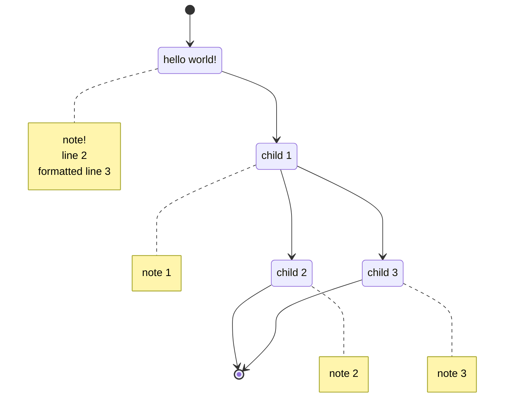

# mermaid-decision-tree

Convert decisions saved as json into mermaid charts.

## sample rendering

f# input:

```f#
Decision(
    Guid.NewGuid(),
    "hello world!",
    "note!\nline 2\n\tformatted line 3",
    Some(
        seq {
            Decision(
                Guid.NewGuid(),
                "child 1",
                "note 1",
                Some(
                    seq {
                        Decision(Guid.NewGuid(), "child 2", "note 2", None)
                        Decision(Guid.NewGuid(), "child 3", "note 3", None)
                    }
                )
            )
        }
    )
)
```

json input:

```json
{
  "Id": "e4e91c62-064f-47cd-ada7-7abce67af4e9",
  "Description": "hello world!",
  "Note": "note!\nline 2\n\tformatted line 3",
  "Child": [
    {
      "Id": "07c1bfc9-3ce0-4415-a889-b207c13906b2",
      "Description": "child 1",
      "Note": "note 1",
      "Child": [
        {
          "Id": "4f0c5d8e-d93d-4290-877e-2ae145950e61",
          "Description": "child 2",
          "Note": "note 2",
          "Child": null
        },
        {
          "Id": "061a7183-55b7-4561-8ae8-8f60c249dfbf",
          "Description": "child 3",
          "Note": "note 3",
          "Child": null
        }
      ]
    }
  ]
}
```

output:

~~~

~~~

rendered output:

