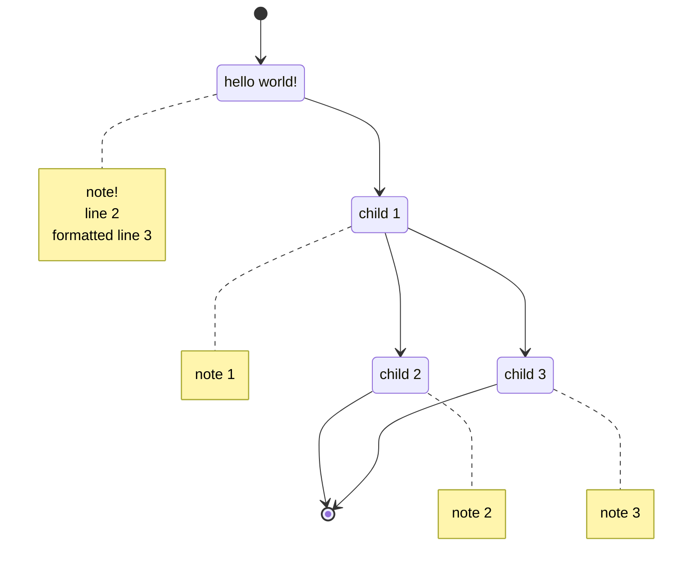

# mermaid-decision-tree

Convert decisions saved as json into mermaid charts.

## sample rendering

input:

```f#
Decision(
    Guid.NewGuid(),
    "hello world!",
    "note!\nline 2\n\tformatted line 3",
    Some(
        seq {
            Decision(
                Guid.NewGuid(),
                "child 1",
                "note 1",
                Some(
                    seq {
                        Decision(Guid.NewGuid(), "child 2", "note 2", None)
                        Decision(Guid.NewGuid(), "child 3", "note 3", None)
                    }
                )
            )
        }
    )
)
```

output:

~~~

~~~

rendered output:

